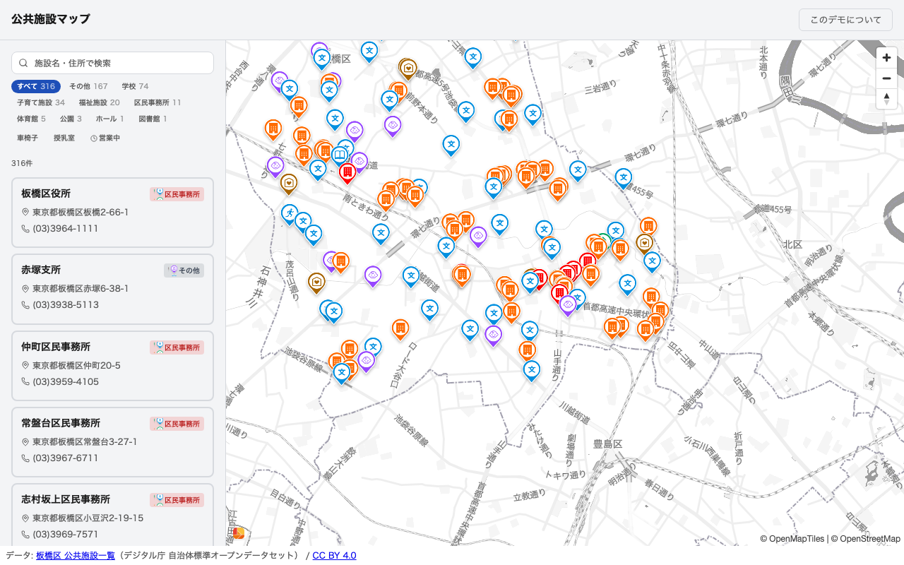

# GeonicDB サンプル: 公共施設マップ

自治体のオープンデータ（公共施設一覧）を [GeonicDB](https://github.com/geolonia/geonicdb) に登録し、[Geolonia Maps](https://geolonia.com/) で可視化する最小構成のサンプルアプリケーションです。



**ライブデモ**: https://geolonia.github.io/geonicdb-sample-public-facility/

## これは何か

板橋区が公開する公共施設一覧（デジタル庁 自治体標準オープンデータセット・CC BY 4.0）を GeonicDB（NGSI-v2 対応 Context Broker）に登録し、リスト表示と地図ピン表示を左右分割・連動させて閲覧できるようにした**読み取り専用**のデモです（混雑状況のリアルタイム監視などは行いません）。

- **業務価値**: 既存のオープンデータを GeonicDB に載せるだけで「施設管理台帳のデジタル化」を最小コストで体感できます。
- **技術リファレンス**: [`@geolonia/geonicdb-sdk`](https://www.npmjs.com/package/@geolonia/geonicdb-sdk) + Geolonia Maps の最小 clean な実装例です。`Use this template` → 自団体データへ差し替え → デプロイ、まで最短距離で辿れる構成にしています。

## クイックスタート

```bash
npm install
cp .env.example .env.local   # 環境変数を設定（次項参照）
npm run dev
```

ブラウザで http://localhost:5173 にアクセスしてください。

## 自分の GeonicDB に向ける

`.env.local` の `VITE_GEONICDB_URL` / `VITE_GEONICDB_TENANT` を書き換えることで、任意の GeonicDB インスタンスに向けられます。

| 接続先 | 手順 |
|---|---|
| (a) ローカルの `geonicdb` | [geonicdb](https://github.com/geolonia/geonicdb) を `clone` → `npm install` → `npm start`（http://localhost:3000 で起動）。`VITE_GEONICDB_URL=http://localhost:3000` |
| (b) Geolonia 発行アカウントの自テナント | Geolonia から発行されたテナントの URL・テナント名を `VITE_GEONICDB_URL` / `VITE_GEONICDB_TENANT` に設定 |

| 変数名 | 説明 |
|---|---|
| `VITE_GEONICDB_URL` | GeonicDB エンドポイント URL |
| `VITE_GEONICDB_TENANT` | GeonicDB のテナント名（`Fiware-Service` ヘッダとして送信。匿名 read アクセスに必要） |
| `VITE_GEOLONIA_API_KEY` | Geolonia Maps API キー（`YOUR-API-KEY` を自分のキーに置き換えてください。[Geolonia Dashboard](https://geolonia.com/) から取得） |

Geolonia Maps の API キーは [Geolonia Dashboard](https://geolonia.com/) から取得してください。

### 環境変数ファイルの使い分け

| ファイル | 用途 | git 管理 |
|---|---|---|
| `.env.example` | キー一覧テンプレート（値なし） | 追跡あり |
| `.env.local` | ローカル開発用オーバーライド | 追跡なし |
| `.env.production` | 本番ビルド用 | 追跡なし |

## データ投入（seed）

同梱の板橋区公共施設データ（CC BY 4.0）でまず試してから、自団体のデータに差し替える2段階です。

```bash
# .env.local に GEONICDB_SEED_URL / GEONICDB_SEED_TENANT / (必要なら) GEONICDB_SEED_TOKEN を設定
npm run seed
```

- `scripts/seed.ts` が同梱の `scripts/data/itabashi-public-facilities.csv` を読み込み、NGSI-v2 の `PublicFacility` エンティティへ変換して投入します。
- 自団体データに差し替える場合は、同じ列構成（デジタル庁 自治体標準オープンデータセットの公共施設一覧フォーマット）の CSV を用意し `npm run seed -- --csv <path>` を実行してください。
- ★ライブデモの `demo` テナント（`geonicdb.geolonia.com`）は匿名・読み取り専用のため投入できません。seed は必ず自分の GeonicDB に対して実行してください。

データの入れ方の詳細は [docs/architecture.md](docs/architecture.md)（③ データの入れ方）を参照してください。

## デプロイ

ビルドした `dist/` は静的ファイルなので、GitHub Pages・Netlify・任意の静的ホスティングにそのまま配置できます。

- **GitHub Pages**（既定）: `main` への push で `.github/workflows/deploy-pages.yml` が自動デプロイします。
- **Netlify**: 雛形（`netlify.toml`）を用意しています。

<!-- P6 で本セクションを手順まで完成させる予定 -->

## カスタマイズ起点

fork して自団体向けに仕立てる際、どこを変えればよいかの一覧です。

| 変えたいもの | 変更箇所 |
|---|---|
| 接続先の GeonicDB / テナント | `.env.local` の `VITE_GEONICDB_URL` / `VITE_GEONICDB_TENANT` |
| 地図の API キー | `.env.local` の `VITE_GEOLONIA_API_KEY` |
| 投入するデータ | `scripts/data/` の CSV ＋ `npm run seed` |
| 施設種別の分類ロジック | `scripts/seed-lib.ts` の `classifyFacilityType` |
| 地図の初期中心・ズーム | `src/components/map/FacilityMapView.tsx` の `initMap({ center, zoom })` |
| エンティティ取得ロジック | `src/hooks/useFacilities.ts` |
| リスト・地図の表示内容 | `src/components/public-facility/` ・ `src/components/map/` |
| このデモ専用の解説ページ | `src/components/about/`（不要なら削除可。手順は本 README 末尾を参照） |

## 技術スタック

- [@geolonia/geonicdb-sdk](https://www.npmjs.com/package/@geolonia/geonicdb-sdk)（`NgsiV2Client`）によるデータ取得
- [Geolonia Maps](https://geolonia.com/)（`@geolonia/embed`）による地図描画
- 静的ホスティングのみ（サーバーサイド実装なし）・匿名 read アクセスで成立

## アーキテクチャ

```text
ブラウザ → localhost:5173 (Vite)
  ├── API リクエスト → VITE_GEONICDB_URL (GeonicDB エンドポイント)
  └── 地図タイル → Geolonia Maps (VITE_GEOLONIA_API_KEY)
```

より詳しい解説（匿名 read で成立する理由・データの入れ方・カスタマイズ観点）は [docs/architecture.md](docs/architecture.md) を参照してください。アプリ内の「このデモについて」リンクからも同じ内容を読めます。

## プロジェクト構成

```text
src/
├── main.tsx                      # エントリポイント
├── App.tsx                       # メインコンポーネント（施設一覧＋地図）
├── App.css                       # スタイル
├── geolonia-embed.d.ts           # @geolonia/embed 型定義オーバーライド
├── components/
│   ├── layout/
│   │   └── MapSidebarLayout.tsx  # リスト⇔地図の左右分割レイアウト
│   ├── map/
│   │   ├── GeonicDbMap.tsx       # Geolonia Maps ラッパー
│   │   └── FacilityMapView.tsx   # 施設ピン地図ビュー
│   ├── public-facility/
│   │   ├── FacilityCard.tsx      # 施設カード
│   │   ├── FacilityList.tsx      # 施設一覧
│   │   ├── FacilityDetail.tsx    # 施設詳細パネル
│   │   └── SpriteIcon.tsx        # スプライトアイコン
│   ├── about/                    # このデモ専用の解説ページ（削除可・後述）
│   └── Attribution.tsx           # データ出典表示
├── hooks/
│   └── useFacilities.ts          # GeonicDB から施設データ取得（SDK）
├── lib/
│   ├── ngsi.ts                   # NGSIv2 API ユーティリティ
│   └── geo-types.ts              # 地理型定義
└── types/
    └── public-facility.ts        # 公共施設エンティティ型
scripts/
├── seed.ts                       # データ投入 CLI エントリポイント
├── seed-lib.ts                   # CSV パース・エンティティ変換ロジック
└── data/                         # 同梱の板橋区公共施設データ（CC BY 4.0）
```

## ビルド

```bash
npm run build
```

`dist/` に静的ファイルが出力されます。

## テスト

```bash
npm test
```

## プレイブック

W2/W3 用の切り出し手順・トラブルシューティングは [docs/playbook.md](docs/playbook.md) を参照してください。

## このデモ専用機能の削除方法

「このデモについて」解説ページ（`src/components/about/`）はこのサンプル専用の機能です。フォークして自団体向けに仕立てる際は不要であれば削除してください。

1. `src/components/about/` ディレクトリを削除する。
2. `src/App.tsx` から `AboutPage` の import・`view` state・`view === 'about'` の分岐・「このデモについて」ボタンを削除する（`// DEMO-ONLY` / `/* DEMO-ONLY START */` 〜 `/* DEMO-ONLY END */` コメントで挟まれた箇所。`grep -rn "DEMO-ONLY" src/` で一覧できる）。
3. `src/App.css` の `DEMO-ONLY START` 〜 `DEMO-ONLY END` ブロック（`.about-link` / `.about-page` 関連スタイル）を削除する。
4. （任意）`docs/architecture.md` を削除する。

## 出典・ライセンス

- データ: 板橋区 公共施設一覧（デジタル庁 自治体標準オープンデータセット） — [CC BY 4.0](https://creativecommons.org/licenses/by/4.0/deed.ja)
- コード: MIT
